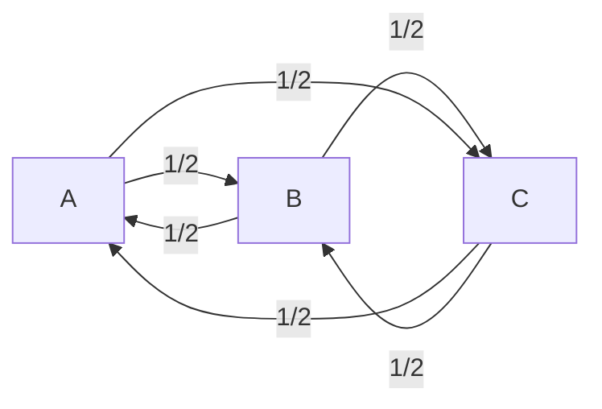
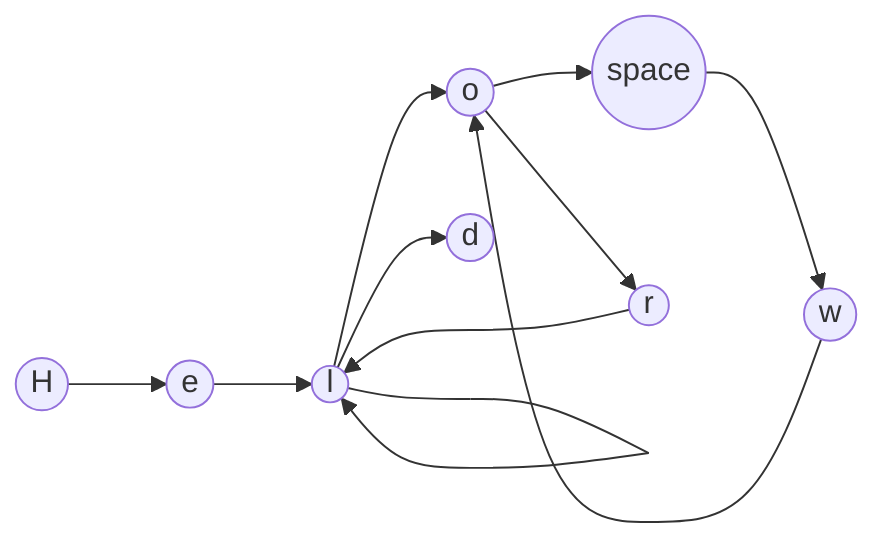
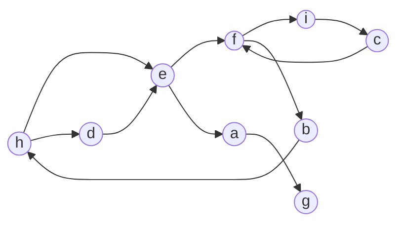

# Markovmatch

#### An algorithm for approximate string matching using inpired by [Markov chains](https://en.wikipedia.org/wiki/Markov_chain)

## Why is it important ?

Approximate string matching is a very common problem in computer science (for text suggestions, spell checking, etc.) and is a very important subject for data processing. For exemple, two database can have the same person but with slightly different spelling.

Finding efficent algorithms for approximate string matching is not easy a common one is [Levenshtein distance](https://en.wikipedia.org/wiki/Levenshtein_distance).

In this small article we will explore an other approach inspired by automatic text generation allowing for a blazingly fast approximate string matching.
(We will also talk about the limitations and possible solutions)

## Introduction to Markov chains

Markov chains are a mathematical system for modelling the probability of a sequence of events.

In a markov chain, the prediction regarding the next event is based solely on the previous event.

**Exemple :**

 We have 3 points : A, B and C and a character :)

The character routine is the following :

- In the morning he wake up at A and go to B
- From B, our character go to C
- They forgot something at home and go back to A to get it
- They remember that they also forgot something at C
- They go back to their friends home at B before coming back to A

We can explain their trip with the following graph :

Where 1/2 is the probability of the event.

Every graph can me matched with something called a transition matrix (isomorphism between the two categories). The one for the markov chain just above is the following :

$$
\begin{bmatrix}
   & a & b & c \\
 a & 0 & \frac{1}{2} & \frac{1}{2} \\
 b & \frac{1}{2} & 0 & \frac{1}{2} \\
 c & \frac{1}{2} & \frac{1}{2} & 0 \\
\end{bmatrix}
$$

The matrix is symetric because all node are bidirectional in this graph.

## The Markovmatch algorithm

The Markovmatch algorithm work in the following way :

- We take a string (exemple : "Hello world")
- We create an unnormalized (1) transition matrix from the string

Ex: **Hello world**

Matrix :

With the character set : H, e, l, o, space, w, r, d

$$
\begin{bmatrix}
    & H & e & l & o & \_ & w & r & d \\
    H & 0 & 1 & 0 & 0 & 0 & 0 & 0 & 0 \\
    e & 0 & 0 & 1 & 0 & 0 & 0 & 0 & 0 \\
    l & 0 & 0 & 1 & 1 & 0 & 0 & 0 & 1 \\
    o & 0 & 0 & 0 & 0 & 1 & 0 & 1 & 0 \\
    \_ & 0 & 0 & 0 & 0 & 0 & 1 & 0 & 0 \\
    w & 0 & 0 & 0 & 1 & 0 & 0 & 0 & 0 \\
    r & 0 & 0 & 1 & 0 & 0 & 0 & 0 & 0 \\
    d & 0 & 0 & 0 & 0 & 0 & 0 & 0 & 0 \\
\end{bmatrix}
$$

(1) Have you noticed something strange ?
This matrix is not normalised (sum of probabilities > 1 :scream: ). Normalisation is very important with transition matrices when we use them in the usual setting of a Markov chain. Here we don't normalise the matrix because we want to limit the matching words linked to this matrix (and we use a modified version which **does not represent real probabilites**).

What do I mean by limiting the matching words ?

Markov chaines use probabilities to predict the next event, here we use the transition matrix for a totally different purpose which is to find a way to measure the "distance" (I will come back later to this word) between two strings.

By counting the loop in the matrix (when > 1) we have additional information that are not available in a normalised transition matrix.

