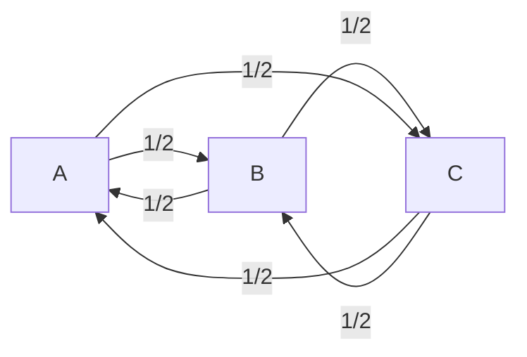
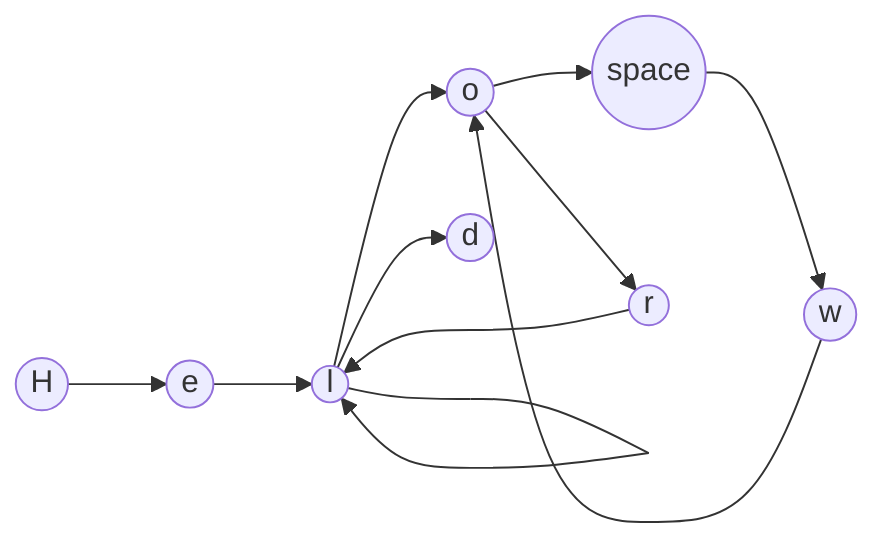
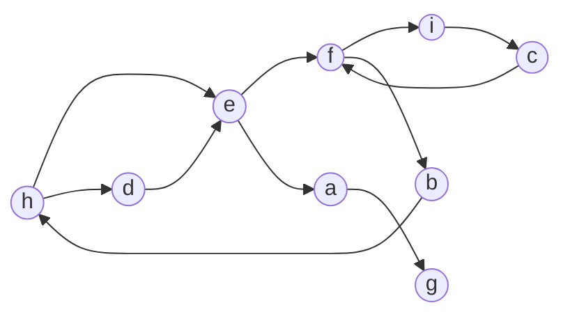
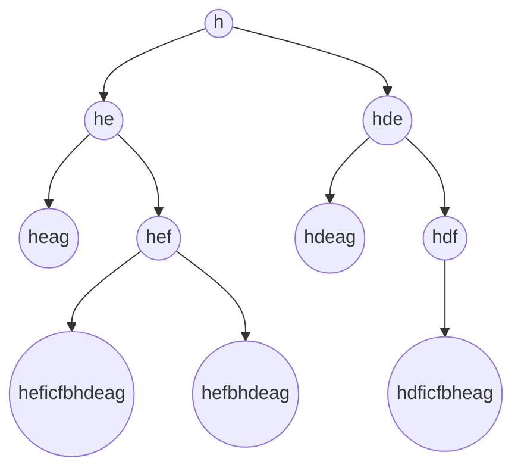

# Markovmatch

#### An algorithm for approximate string matching inspired by [Markov chains](https://en.wikipedia.org/wiki/Markov_chain) / Graph theory

## Why is it important ?

Approximate string matching is a very common problem in computer science (for text suggestions, spell checking, etc.) and is a very important subject for data processing. For exemple, two database can have the same datas but with slightly different spelling.

Finding efficent algorithms for approximate string matching is not easy. A common one is [Levenshtein distance](https://en.wikipedia.org/wiki/Levenshtein_distance).

In this small article we will explore an other approach inspired by automatic text generation allowing for a blazingly fast approximate string matching.
(We will also talk about the limitations and possible solutions)

## Introduction to Markov chains

Markov chains are a mathematical system for modelling the probability of a sequence of events.

In a markov chain, the prediction regarding the next event is based solely on the previous event.

**Exemple :**

 We have 3 points : A, B and C and a character :)

The character routine is the following :

- In the morning they wake up at A and go to B
- From B, our character go to C
- They forgot something at home and go back to A to get it
- They remember that they also forgot something at C
- They go back to their friends home at B before coming back to A

We can explain their trip with the following graph :

Where 1/2 is the probability of the event.

Every graph can me matched with something called a transition matrix (also known as adjacency matrix. The contrary is not always true, there exist a non injective and non surjective mapping between the class of n-noded directional connected graphs and the class of $n \times n$ matrix).
The one for the markov chain just above is the following :

$$
\begin{bmatrix}
   & a & b & c \\
 a & 0 & \frac{1}{2} & \frac{1}{2} \\
 b & \frac{1}{2} & 0 & \frac{1}{2} \\
 c & \frac{1}{2} & \frac{1}{2} & 0 \\
\end{bmatrix}
$$

The matrix is symetric because all node are bidirectional in this graph.

## How does the algorithm work ?

The Markovmatch algorithm work in the following way :

The first steps :

- We take a string (exemple : "Hello world")
- We create an unnormalized (1) adjacency matrix from this string

Ex: **Hello world**

Matrix :

Here we use the character set : H, e, l, o, space, w, r, d; This character set is only for desmonstation purpose.
We will usually use the extended lowercase latin alphabet.

$$
\begin{bmatrix}
    & H & e & l & o & \_ & w & r & d \\
    H & 0 & 1 & 0 & 0 & 0 & 0 & 0 & 0 \\
    e & 0 & 0 & 1 & 0 & 0 & 0 & 0 & 0 \\
    l & 0 & 0 & 1 & 1 & 0 & 0 & 0 & 1 \\
    o & 0 & 0 & 0 & 0 & 1 & 0 & 1 & 0 \\
    \_ & 0 & 0 & 0 & 0 & 0 & 1 & 0 & 0 \\
    w & 0 & 0 & 0 & 1 & 0 & 0 & 0 & 0 \\
    r & 0 & 0 & 1 & 0 & 0 & 0 & 0 & 0 \\
    d & 0 & 0 & 0 & 0 & 0 & 0 & 0 & 0 \\
\end{bmatrix}
$$

#### (1) Have you noticed something strange ?

This matrix is not normalised (sum of "probabilities" > 1 :scream: ). Normalisation is very important with transition matrices when we use them in the usual setting of a Markov chain. Here we don't normalise the matrix because we want to limit the number of possible matching words linked to this matrix, **we are not working with probabilities but quantities**.

#### What do I mean by limiting the matching words ?

Markov chaines use probabilities to predict the next event, here we use the adjacency matrix for a totally different purpose which is to find a way to measure the "distance" (I will come back later to this word) between two strings.

By counting the double link in the matrix (when > 1) we have additional information that are not available in a normalised transition matrix.

**Here is an exemple :**

We have this graph

We start from the letter "h", let's see all the possible word we can build by going only one time by each edge of the graph.

Matrix :

With the character set : a,b,c,d,e,f,g,h,i

$$
\begin{bmatrix}
      & a & b & c & d & e & f & g & h & i \\
    a & 0 & 0 & 0 & 0 & 0 & 0 & 1 & 0 & 0 \\
    b & 0 & 0 & 0 & 0 & 0 & 0 & 0 & 1 & 0 \\
    c & 0 & 0 & 0 & 0 & 0 & 1 & 0 & 0 & 0 \\
    d & 0 & 0 & 0 & 0 & 1 & 0 & 0 & 0 & 0 \\
    e & 1 & 0 & 0 & 0 & 0 & 1 & 0 & 0 & 0 \\
    f & 0 & 0 & 0 & 0 & 0 & 0 & 0 & 0 & 1 \\
    g & 0 & 0 & 0 & 0 & 0 & 0 & 0 & 0 & 0 \\
    h & 0 & 0 & 0 & 1 & 1 & 0 & 0 & 0 & 0 \\
    i & 0 & 0 & 1 & 0 & 0 & 0 & 0 & 0 & 0 \\
\end{bmatrix}
$$

Several words can give the same graph, therefore there is **no** isomorphism between the set of strings (+starting letter) and the set of adjacency matrix.

#### Is this a problem ?

Not really, we are going to see why :

The possible words don't mean anything and it's going to be the case most of the time. Beside that, strings that are much longer than the one we are looking for will get penalised by the algorithm due to the fact they have a lot of unused edges, **this penality is comming from the fact that the matrix is not normalised. We have an exact idea of the number of connection there are in a word, if a string has more letters, the number of edge is going to be much greater, when we are going to compute the absolute difference between the two matrices, the resulting matrix will be very different from an empty one**.

#### We converted the string to a matrix but what do we do now ?

Matrix are numerical, we can therefore do operations on them.

##### Let's talk about the distance between two matrices

In mathematics, a distance is computed thanks to a norm.

A norm in a vector space ($V$) is a function that takes a element from the space and returns a positive real number.

Notation : ||.||

The norm has to satisfy the following properties :

- The norm output is always non-negative
- The norm has to satify the triangle inequality
- For all X in the space, $||\lambda . X||=|\lambda|.||X||$
- $||X||=0$ if and only if $X=0_V$

A distance is defined in the following way :

$$ d(X,Y) = ||X-Y|| $$

##### Defintion of the norm we are going to use

$$ ||X|| = \sum_{i=0, j=0}^{dim(X)} |X_{i,j}| $$

We check if this is a valid norm :

1. We check the triangle inequality :

$$ || X + Y || \leq ||X|| + ||Y|| $$

$$ ||X + Y|| = \sum_{i=0, j=0}^{dim(X)} |X_{i,j} + Y_{i,j}| $$

We know that : $ |X_{i,j} + Y_{i,j}| \leq |X_{i,j}| + |Y_{i,j}|$

Therefore :

$$ ||X + Y|| \leq \sum_{i=0, j=0}^{dim(X)} |X_{i,j}| + |Y_{i,j}| $$

$$ \Leftrightarrow $$

$$ ||X + Y|| \leq \sum_{i=0, j=0}^{dim(X)} |X_{i,j}| + \sum_{i=0}^{dim(X)} |Y_{i,j}|$$

We verfied the triangle inequality

2. We verify the homogeneity of the norm

the norm is homogeneous if and only if $ ||\lambda . X || = | \lambda | . ||X||$

let's prove it,

$$ || \lambda . X || = \sum_{i=0,j=0}^{dim(X)} |\lambda . X_{i,j}| = |\lambda| \sum_{i=0,j=0}^{dim(X)} |X_{i,j}| = |\lambda|.||X||$$

3. We verify that $||X|| = 0$ if and only if $X=0_V$

$$ ||X|| = \sum_{i=0, j=0}^{dim(X)} |X_{i,j}| = 0 \Leftrightarrow X=0_V $$

4. The norm is positive valued because it's a sum of absolute values

This is not a usual [Matrix norm](https://en.wikipedia.org/wiki/Matrix_norm) but a "Entry-wise" norm. This norm has been chosen because the computational cost is really low.

The distance we will use is therefore the distance induced by this norm.

$$d(X,Y)=||Y-X||_{1,1}$$

##### We are reaching the core of the algorithm, now let's summarise the maths

As explained above, a graph can correspond to a set of strings.

Let $G$ be a graph and $S$ be a string and $f(S)$ be a function that takes a string and returns a graph.

$f$ is neither surjective nor injective.

Therefore it's impossible to talk about the distance between two strings (due to the fact that several strings can give the same graph and therefore different string can have a distance of 0).

We are in something called a [pseudo-metric space](https://en.wikipedia.org/wiki/Pseudo-metric_space) with $d(S_1,S_2)$ the pseudo-distance between two strings.

As explained earlier that's not really a problem due to the type of object we are dealing with.

Now, let's summerise the algorithm in 2 steps :

1. We compute each string's matrix (with a given alphabet shared for both conversion)

2. We compute the distance between each string matrix using the norm we defined earlier.

**Here it is !**

#### Now it's time to test it, how does it compare with common algorithms used in the field ?

We are going to analyse the following metrics to do the tests : Speed and accuracy.

Naive testing on the hotel dataset :

Sample of results :

|Initial name| guessed match | real match|
|-----------|-------------------|----------------|
|Deluxe Room, 1 King Bed|deluxe king room|Deluxe King Room|
|Standard Room, 1 King Bed, Accessible|standard king room|Standard King Roll-in Shower Accessible|
|Grand Corner King Room, 1 King Bed|grand corner king room|Grand Corner King Room|
|Suite, 1 King Bed (Parlor)|king parlor suite|King Parlor Suite|
|High-Floor Premium Room, 1 King Bed|high-floor premium king room|High-Floor Premium King Room|
|Traditional Double Room, 2 Double Beds|double room with two double beds|Double Room with Two Double Beds|
|Room, 1 King Bed, Accessible|king room|King Room - Disability Access|
|Deluxe Room, 1 King Bed|deluxe king room|Deluxe King Room|
|Deluxe Room|deluxe king room|Deluxe Double Room|
|Room, 2 Double Beds (19th to 25th Floors)|two double beds - location room (19th to 25th floors)|Two Double Beds - Location Room (19th to 25th Floors)|
|Room, 1 King Bed (19th to 25 Floors)|king bed - location room (19th to 25th floors)|King Bed - Location Room (19th to 25th Floors)|
|Deluxe Room|deluxe king room|Deluxe Double Room|
|Junior Suite, 1 King Bed with Sofa Bed|deluxe king suite with sofa bed|Junior Suite|
|Signature Room, 2 Queen Beds|signature two queen|Signature Two Queen|
|Signature Room, 1 King Bed|signature king|Signature One King|
|Premium Room, 2 Queen Beds|queen room|Premium Two Queen|
|Studio, 1 King Bed with Sofa bed, Corner|corner king studio|Corner King Studio|
|Club Room, 2 Queen Beds|queen room|Club Queen Room With Two Queen Beds and Free Wi-Fi|
|Club Room, 1 King Bed|king room|Club King Room With Free Wi-Fi|
|Club Room, Premium 2 Queen Beds|club premium two queen|Club Premium Two Queen|
|Suite, 1 Bedroom|one bedroom suite|One - Bedroom Suite|

**Accuracy : 58.3%**

Even if the algorithm is not perfect, it's still a good start. This task is really difficult, a lot of the same vocabulary being used each time. Beside that it's important to remember that it's the naive algorithm that we are testing. Some result are showed multiple time. We will see later how we can solve that problem.

But let's see with naive Levenshtein, how does it compare ?

Sample of results :

|Initial name| guessed match | real match|
|-----------|-------------------|----------------|
|Deluxe Room, 1 King Bed|deluxe room - one king bed|Deluxe King Room|
|Standard Room, 1 King Bed, Accessible|standard king roll-in shower accessible|Standard King Roll-in Shower Accessible|
|Grand Corner King Room, 1 King Bed|grand corner king room|Grand Corner King Room|
|Suite, 1 King Bed (Parlor)|business king room|King Parlor Suite|
|High-Floor Premium Room, 1 King Bed|high-floor premium king room|High-Floor Premium King Room|
|Traditional Double Room, 2 Double Beds|business double room with two double beds|Double Room with Two Double Beds|
|Room, 1 King Bed, Accessible|gold king suite|King Room - Disability Access|
|Deluxe Room, 1 King Bed|deluxe room - one king bed|Deluxe King Room|
|Deluxe Room|queen room|Deluxe Double Room|
|Room, 2 Double Beds (19th to 25th Floors)|king bed - location room (19th to 25th floors)|Two Double Beds - Location Room (19th to 25th Floors)|
|Room, 1 King Bed (19th to 25 Floors)|king bed - location room (19th to 25th floors)|King Bed - Location Room (19th to 25th Floors)|
|Deluxe Room|queen room|Deluxe Double Room|
|Junior Suite, 1 King Bed with Sofa Bed|deluxe king suite with sofa bed|Junior Suite|
|Signature Room, 2 Queen Beds|signature two queen|Signature Two Queen|
|Signature Room, 1 King Bed|signature one king|Signature One King|
|Premium Room, 2 Queen Beds|premium two queen|Premium Two Queen|
|Studio, 1 King Bed with Sofa bed, Corner|deluxe king suite with sofa bed|Corner King Studio|
|Club Room, 2 Queen Beds|deluxe room - two queen beds|Club Queen Room With Two Queen Beds and Free Wi-Fi|
|Club Room, 1 King Bed|club one king|Club King Room With Free Wi-Fi|
|Club Room, Premium 2 Queen Beds|club premium two queen|Club Premium Two Queen|
|Suite, 1 Bedroom|queen room|One - Bedroom Suite|
|Deluxe Room, City View|queen room with city view|Deluxe King Or Queen Room|
|Deluxe Room, Lake View|deluxe double room|Deluxe King Or Queen Room with Lake View|
|Club Room, City View (Club Lounge Access for 2 guests)|double room with two double beds|Club Level King Or Queen Room with City View|
|Club Room, Lake View (Club Lounge Access for 2 guests)|double room with two double beds|Club Level King Or Queen Room with Water View|
|Deluxe Room, 1 King Bed|deluxe room - one king bed|Deluxe King Room|
|Deluxe Room, 2 Queen Beds|deluxe room - two queen beds|Deluxe Room - Two Queen Beds|
|Premier Room, 1 King Bed (Royal Club)|deluxe room (non refundable)|Royal Club Premier Room - One King Bed|
|Room, 2 Double Beds, Non Smoking|deluxe double room|Double Room with Two Double Beds|
|Room, 1 King Bed, Non Smoking (LEISURE)|city view with one king bed|King Room|
|Executive Room, 1 King Bed, Non Smoking|executive king room|Executive King Room|
|Suite, 1 King Bed, Non Smoking|signature one king|King Suite|
|Room, 1 Queen Bed, Non Smoking (Fairmont Room)|grand corner king room|Queen Room|

[Source for the implementation of Levenshtein Distance algorithm in typescript used for this test](https://gist.github.com/keesey/e09d0af833476385b9ee13b6d26a2b84)

**Accuracy: 24.2%** :scream:

Naive levenshtein distance algorithm scores even worst. I said that wasn't an easy problem to solve.

##### What can we do now to improve the accuracy for this specific task?

The two columns should have a one to one match, therefore, a result cannot be one name in one column for two different names in the other column.

What we are trying to solve here is called in computer science the assignment problem.

For the purpose of this article we will use a polynomial time algorithm to solve this problem called the [Hungarian algorithm](https://en.wikipedia.org/wiki/Hungarian_algorithm).

Here is the result, the success rate is now of 86.4% :scream:

This is a sharp improvement over the naive algorithm.

Levendshtein will not be tested again for this task due to the fact that the algorithm is not the best suited for this task anyway. Under the hood, the levenshtein algorithm works by counting the action needed to go from a string to an other and therefore for flexible text like the one with the names of the hotels, it can perform quite poorly.

But is our algorithm the best suited for all tasks? 

Not really. Due to the fact the algorithm works using letter combinations pattern it's possible to have horrible results if we cherrypick the dataset.

for exemple :

We have a dataset with names of individual :

Joseph
Mary
John
Matthew
Robert
Aaron

If we forget half the letter during the spelling, ex Jsef to find Joseph will will have result that are much worse than levenshtein.

An impovment that could be done is to add other letter in the adjacency matrix that match with possible spelling mistakes.

"eph" from Joseph could be encoded in the matrix by the addition of sequences e -> p -> h with a higher weight and e -> f with a lower weight.

