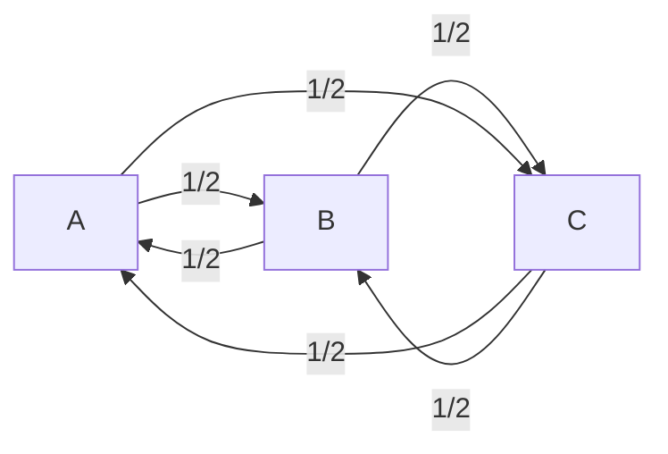
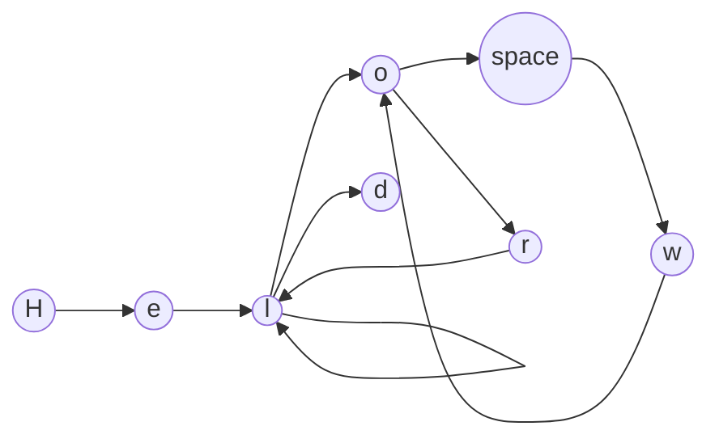
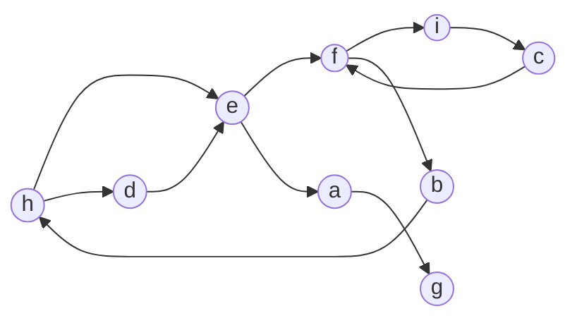
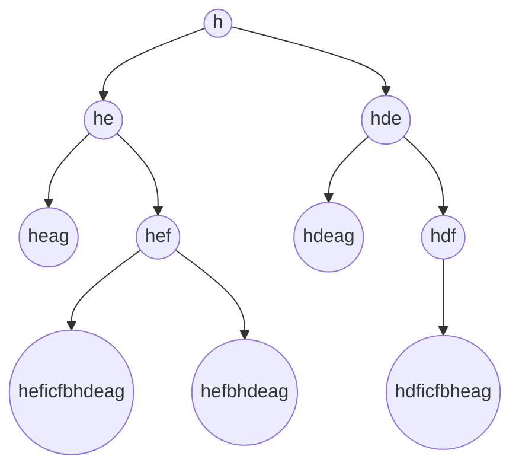

# Approximate string matching, a deeper look into the bigram method

#### An algorithm for approximate string matching inspired by [Markov chains](https://en.wikipedia.org/wiki/Markov_chain) / Graph theory

## Why is it important?

Approximate string matching is a very common problem in computer science (for text suggestions, spell checking, etc.) and is a very important subject for data processing. For example, two databases can have the same data but with a slightly different spelling.

Finding efficient algorithms for approximate string matching is not easy. A common one is [Levenshtein distance](https://en.wikipedia.org/wiki/Levenshtein_distance).

In this small article, we will explore another approach inspired by automatic text generation allowing for a blazingly fast approximate string matching.
(We will also talk about the limitations and possible solutions)

The method used in the presentation is equivalent to the bigram method. This method is widely used in string matching engines. Here we will explore it but from another perspective (allowing for a faster algorithm than what could be done naively).

## Introduction to Markov chains

Markov chains are a mathematical system for modeling the probability of a sequence of events.

In a Markov chain, the prediction regarding the next event is based solely on the previous event.

**Example :**

 We have 3 points: A, B and C and a character :)

The character routine is the following :

- In the morning they wake up at A and go to B
- From B, our character goes to C
- They forgot something at home and go back to A to get it
- They remember that they also forgot something at C
- They go back to their friend's home at B before coming back to A

We can explain their trip with the following graph :



Where 1/2 is the probability of the event.

Every graph can be matched with something called a transition matrix (also known as an adjacency matrix. The contrary is not always true, there exists an injective mapping between the class of n-noded directed graphs and the class of $n \times n$ matrix).
The one for the Markov chain just above is the following :

$$
\begin{bmatrix}
   & a & b & c \\
 a & 0 & \frac{1}{2} & \frac{1}{2} \\
 b & \frac{1}{2} & 0 & \frac{1}{2} \\
 c & \frac{1}{2} & \frac{1}{2} & 0 \\
\end{bmatrix}
$$

The matrix is symmetric because all connections are bidirectional in this graph.

## How does the algorithm work?

The algorithm work in the following way :

The first steps :

- We take a string (example: "Hello world")
- We create an unnormalized (1) adjacency matrix from this string

Ex: **Hello world**



Matrix :

Here we use the character set: H, e, l, o, space, w, r, d; This character set is only for demonstration purposes.
We will usually use the extended lowercase Latin alphabet.

$$\begin{bmatrix}
      & H & e & l & o &  & w & r & d \\
    H & 0 & 1 & 0 & 0 & 0 & 0 & 0 & 0 \\
    e & 0 & 0 & 1 & 0 & 0 & 0 & 0 & 0 \\
    l & 0 & 0 & 1 & 1 & 0 & 0 & 0 & 1 \\
    o & 0 & 0 & 0 & 0 & 1 & 0 & 1 & 0 \\
     & 0 & 0 & 0 & 0 & 0 & 1 & 0 & 0 \\
    w & 0 & 0 & 0 & 1 & 0 & 0 & 0 & 0 \\
    r & 0 & 0 & 1 & 0 & 0 & 0 & 0 & 0 \\
    d & 0 & 0 & 0 & 0 & 0 & 0 & 0 & 0 \\
\end{bmatrix}$$

#### (1) Have you noticed something strange?

This matrix is not normalised (sum of "probabilities" > 1 :scream: ). Normalisation is very important with transition matrices when we use them in the usual setting of a Markov chain. Here we don't normalise the matrix because we want to limit the number of possible matching words linked to this matrix, **we are not working with probabilities but quantities**.

#### What do I mean by limiting the matching words?

Markov chains use probabilities to predict the next event, here we use the adjacency matrix for a different purpose which is to find a way to measure the "distance" (I will come back later to this word) between two strings.

By counting the double link in the matrix (when > 1) we have additional informations that are not available in a normalised transition matrix.

**Here is an example:**

We have this graph



We start from the letter "h", let's see all the possible words we can build by only going through each edge of the graph one time.

Matrix :

With the character set : a,b,c,d,e,f,g,h,i

$$
\begin{bmatrix}
      & a & b & c & d & e & f & g & h & i \\
    a & 0 & 0 & 0 & 0 & 0 & 0 & 1 & 0 & 0 \\
    b & 0 & 0 & 0 & 0 & 0 & 0 & 0 & 1 & 0 \\
    c & 0 & 0 & 0 & 0 & 0 & 1 & 0 & 0 & 0 \\
    d & 0 & 0 & 0 & 0 & 1 & 0 & 0 & 0 & 0 \\
    e & 1 & 0 & 0 & 0 & 0 & 1 & 0 & 0 & 0 \\
    f & 0 & 0 & 0 & 0 & 0 & 0 & 0 & 0 & 1 \\
    g & 0 & 0 & 0 & 0 & 0 & 0 & 0 & 0 & 0 \\
    h & 0 & 0 & 0 & 1 & 1 & 0 & 0 & 0 & 0 \\
    i & 0 & 0 & 1 & 0 & 0 & 0 & 0 & 0 & 0 \\
\end{bmatrix}
$$



Several words can give the same graph, therefore there is **no** isomorphism between the set of strings (+starting letter) and the set of adjacency matrices.

#### Is this a problem?

Not really, we are going to see why :

The possible words don't mean anything and it's going to be the case most of the time. Besides that, strings that are much longer than the one we are looking for will get penalised by the algorithm due to the fact they have a lot of unused edges, **this penalty is coming from the fact that the matrix is not normalised. We have an exact idea of the number of connections there are in a word, if a string has more letters, the number of edges is going to be much greater, when we are going to compute the absolute difference between the two matrices, the resulting matrix will be very different from an empty one**.

#### We converted the string to a matrix but what do we do now?

##### Let's talk about the distance between two matrices

In mathematics, a distance is computed thanks to a norm.

A norm in a vector space $V$ is a function that takes an element from the space and returns a positive real number.

Notation : ||.||

The norm has to satisfy the following properties :

- The norm output is always non-negative
- The norm has to satisfy the triangle inequality
- For all X in the space, $||\lambda . X||=|\lambda|.||X||$
- $||X||=0$ if and only if $X=0_V$

A distance is defined in the following way :

$$ d(X,Y) = ||X-Y|| $$

The [Matrix norm](https://en.wikipedia.org/wiki/Matrix_norm) we are going to use is an "Entry-wise" norm. This norm has been chosen because the computational cost is really low.
(The demonstration is available in the [Github repository](https://github.com/Antix5/markovmatch/blob/master/normdemo.md))

This norm can also be seen as a different version of the Manhattan norm.

The distance we will use is therefore the distance induced by this norm.

$$d(X,Y)=||Y-X||_{1,1}$$

##### We are reaching the core of the algorithm, now let's summarise the maths

As explained above, a graph can correspond to a set of strings.

Let $G$ be a graph and $S$ be a string and $f(S)$ be a function that takes a string and returns a graph.

$f$ is neither surjective nor injective.

Therefore it's impossible to talk about the distance between two strings (because several strings can give the same graph and therefore different strings can have a distance of 0).

We are dealing with something called a [pseudo-metric space](https://en.wikipedia.org/wiki/Pseudo-metric_space) with $d(S_1, S_2)$ the pseudo-distance between two strings.

As explained earlier that's not a problem due to the type of object we are dealing with.

Now, let's summarise the algorithm in 2 steps :

1. We compute each string's matrix (with a given alphabet shared for both conversions)

2. We compute the distance between each string's matrix using the norm we defined earlier.

**Here it is!**

#### Now it's time to test it, how does it compare with a common algorithm used in the field?

We are going to analyse the following metrics: Speed and accuracy.

Naive testing on the hotel dataset :

Sample of results :

|Initial name| guessed match | real match|
|-----------|-------------------|----------------|
|Deluxe Room, 1 King Bed|deluxe king room|Deluxe King Room|
|Standard Room, 1 King Bed, Accessible|standard king room|Standard King Roll-in Shower Accessible|
|Grand Corner King Room, 1 King Bed|grand corner king room|Grand Corner King Room|
|Suite, 1 King Bed (Parlor)|king parlor suite|King Parlor Suite|
|High-Floor Premium Room, 1 King Bed|high-floor premium king room|High-Floor Premium King Room|
|Traditional Double Room, 2 Double Beds|double room with two double beds|Double Room with Two Double Beds|
|Room, 1 King Bed, Accessible|king room|King Room - Disability Access|
|Deluxe Room, 1 King Bed|deluxe king room|Deluxe King Room|
|Deluxe Room|deluxe king room|Deluxe Double Room|
|Room, 2 Double Beds (19th to 25th Floors)|two double beds - location room (19th to 25th floors)|Two Double Beds - Location Room (19th to 25th Floors)|
|Room, 1 King Bed (19th to 25 Floors)|king bed - location room (19th to 25th floors)|King Bed - Location Room (19th to 25th Floors)|
|Deluxe Room|deluxe king room|Deluxe Double Room|
|Junior Suite, 1 King Bed with Sofa Bed|deluxe king suite with sofa bed|Junior Suite|
|Signature Room, 2 Queen Beds|signature two queen|Signature Two Queen|
|Signature Room, 1 King Bed|signature king|Signature One King|
|Premium Room, 2 Queen Beds|queen room|Premium Two Queen|
|Studio, 1 King Bed with Sofa bed, Corner|corner king studio|Corner King Studio|
|Club Room, 2 Queen Beds|queen room|Club Queen Room With Two Queen Beds and Free Wi-Fi|
|Club Room, 1 King Bed|king room|Club King Room With Free Wi-Fi|
|Club Room, Premium 2 Queen Beds|club premium two queen|Club Premium Two Queen|
|Suite, 1 Bedroom|one bedroom suite|One - Bedroom Suite|

**Accuracy : 58.3%**

Even if the algorithm is not perfect, it's still a good start. This task is really difficult, with a lot of the same vocabulary being used each time. Besides that, it's important to remember that it's the naive algorithm that we are testing. Some results are shown multiple times. We will see later how we can solve that problem.

But let's see with naive Levenshtein, how does it compare?

Sample of results :

|Initial name| guessed match | real match|
|-----------|-------------------|----------------|
|Deluxe Room, 1 King Bed|deluxe room - one king bed|Deluxe King Room|
|Standard Room, 1 King Bed, Accessible|standard king roll-in shower accessible|Standard King Roll-in Shower Accessible|
|Grand Corner King Room, 1 King Bed|grand corner king room|Grand Corner King Room|
|Suite, 1 King Bed (Parlor)|business king room|King Parlor Suite|
|High-Floor Premium Room, 1 King Bed|high-floor premium king room|High-Floor Premium King Room|
|Traditional Double Room, 2 Double Beds|business double room with two double beds|Double Room with Two Double Beds|
|Room, 1 King Bed, Accessible|gold king suite|King Room - Disability Access|
|Deluxe Room, 1 King Bed|deluxe room - one king bed|Deluxe King Room|
|Deluxe Room|queen room|Deluxe Double Room|
|Room, 2 Double Beds (19th to 25th Floors)|king bed - location room (19th to 25th floors)|Two Double Beds - Location Room (19th to 25th Floors)|
|Room, 1 King Bed (19th to 25 Floors)|king bed - location room (19th to 25th floors)|King Bed - Location Room (19th to 25th Floors)|
|Deluxe Room|queen room|Deluxe Double Room|
|Junior Suite, 1 King Bed with Sofa Bed|deluxe king suite with sofa bed|Junior Suite|
|Signature Room, 2 Queen Beds|signature two queen|Signature Two Queen|
|Signature Room, 1 King Bed|signature one king|Signature One King|
|Premium Room, 2 Queen Beds|premium two queen|Premium Two Queen|
|Studio, 1 King Bed with Sofa bed, Corner|deluxe king suite with sofa bed|Corner King Studio|
|Club Room, 2 Queen Beds|deluxe room - two queen beds|Club Queen Room With Two Queen Beds and Free Wi-Fi|
|Club Room, 1 King Bed|club one king|Club King Room With Free Wi-Fi|
|Club Room, Premium 2 Queen Beds|club premium two queen|Club Premium Two Queen|
|Suite, 1 Bedroom|queen room|One - Bedroom Suite|
|Deluxe Room, City View|queen room with city view|Deluxe King Or Queen Room|
|Deluxe Room, Lake View|deluxe double room|Deluxe King Or Queen Room with Lake View|
|Club Room, City View (Club Lounge Access for 2 guests)|double room with two double beds|Club Level King Or Queen Room with City View|
|Club Room, Lake View (Club Lounge Access for 2 guests)|double room with two double beds|Club Level King Or Queen Room with Water View|
|Deluxe Room, 1 King Bed|deluxe room - one king bed|Deluxe King Room|
|Deluxe Room, 2 Queen Beds|deluxe room - two queen beds|Deluxe Room - Two Queen Beds|
|Premier Room, 1 King Bed (Royal Club)|deluxe room (non refundable)|Royal Club Premier Room - One King Bed|
|Room, 2 Double Beds, Non Smoking|deluxe double room|Double Room with Two Double Beds|
|Room, 1 King Bed, Non Smoking (LEISURE)|city view with one king bed|King Room|
|Executive Room, 1 King Bed, Non Smoking|executive king room|Executive King Room|
|Suite, 1 King Bed, Non Smoking|signature one king|King Suite|
|Room, 1 Queen Bed, Non Smoking (Fairmont Room)|grand corner king room|Queen Room|

[Source for the implementation of Levenshtein Distance algorithm in typescript used for this test](https://gist.github.com/keesey/e09d0af833476385b9ee13b6d26a2b84)

**Accuracy: 24.2%** :scream:

The naive Levenshtein distance algorithm scores even worst. I said that wasn't an easy problem to solve.

(We will see later why this specific algorithm scored that badly)

##### What can we do now to improve the accuracy for this specific task?

The two columns should have a one-to-one match, therefore, a result cannot be one name in one column for two different names in the other column.

What we are trying to solve here is called in computer science the assignment problem. We will use a polynomial time algorithm to solve this problem called the [Hungarian algorithm](https://en.wikipedia.org/wiki/Hungarian_algorithm).

*Here is the result, the success rate is now **86.4%** :scream:*

This is a sharp improvement over the naive algorithm.

Levenshtein will not be tested again for this task because the algorithm is not the best suited for this purpose anyway. Under the hood, the Levenshtein algorithm works by counting the action needed to go from one string to another and therefore for flexible text like the one with the names of the hotels, it can perform quite poorly.

But is our algorithm the best suited for all tasks?

Not really. The algorithm works using letter combination matching, therefore it's possible to have horrible results if we cherrypick the dataset.

For example:

We have a dataset with the names of individuals:

Joseph
Mary
John
Matthew
Robert
Aaron

If we forget half the letter during the spelling, ex Jsef to find Joseph we will have results that are much worse than with Levenshtein. An improvement that could be done is to add another letter combination in the adjacency matrix to detect possible spelling mistakes.

"eph" from Joseph could be encoded in the matrix by the addition of sequences $e \rightarrow p \rightarrow h$ with a higher weight and $e \rightarrow f$ with a lower weight.

#### Conclusion regarding the quality of the algorithm

The algorithm is quite good at finding the best match, even with strings with a lot of modifications. Although, some spelling that would be detected by Levenshtein will not be identified correctly with this one (modification could be made to improve the efficiency in that case).

#### Now, let's talk about the speed of the algorithm

Due to the lack of huge datasets, to have a good idea of the string matching on a large scale I will focus on the complexity of the algorithm and an approximate example on the search part.

The algorithm has complexity for the comparison of O(n). This is because the algorithm is doing a subtraction over the entire dataset. So the time is proportional to the number of matrices to subtract (even if the values will be stored in a vector).

The speed can be further improved by limiting the max weight in the matrix to 1 and storing the matrix as a list of boolean (even if this will reduce the efficiency).

We will suppose that we limit ourselves to a set of 66 characters: "abcdefghijklmnopqrstuvwxyz- éèàçâêîôûäëïöü.,;:!?()[]{}1234567890"

So here the list of boolean will be of size 66^2 = 4356.

After that, we can apply a XOR operation to the list and count the number of True values.

Example in Rust :

```Rust

use rand;

fn main(){

    // We generate a random dataset of size 1000 (vectors of 4356 boolean values)

    let mut dataset = Vec::new();
    for _ in 0..100000 {
        let mut vector = Vec::new();
        for _ in 0..4356 {
            vector.push(rand::random::<bool>());
        }
        dataset.push(vector);
    }

    let firstelement = &dataset[0];

    // We measure the time it takes to execute the following code


    // We start the timer
    let start = std::time::Instant::now();

    // We apply the comparison on the entire dataset
    let error : Vec<u16> = dataset.iter().map(|x| compare_fingerprints(x, &firstelement)).collect();


    // We stop the timer and display the time elapsed
    let end = std::time::Instant::now();

    let duration = end.duration_since(start);

    println!("{:?}", duration);

}

fn compare_fingerprints(fingerprint1: &[bool], fingerprint2: &[bool]) -> u16 {
    // We reset the timer to 0
    let mut count = 0;

    // We iterate over the entire list of boolean values
    for i in 0..fingerprint1.len() {
        // if XOR is true, we increment the count
        if fingerprint1[i] ^ fingerprint2[i] {
            count += 1;
        }
    }
    // We return the count
    count
}

```

To give an idea, this code takes about 78.8245ms to check the 100000 lines of the dataset with the code just above.
This job could also be done in parallel which would allow for a reduction in computation time.

### Conclusion

This modified bigram method is an efficient method to find close matches in a dataset while limiting computation time.
Although there is still some room for improvement and this method should not be chosen in total disregard of the use case.

This method also works very well with other algorithms like the Hungarian algorithm if we need to match the values with another dataset.

##### Thanks for reading this article.
You can find the code on [Github](https://github.com/Antix5/markovmatch) and find me on [LinkedIn](https://www.linkedin.com/in/antoine-demangeon/)

The Hotel Room dataset has been created by [Susan Li](https://www.linkedin.com/in/susanli/) and the dataset can be found on [Kaggle](https://www.kaggle.com/datasets/leandrodoze/room-type)

Source for the Hungarian algorithm implementation: [Github](https://github.com/addaleax/munkres-js) (this is a very complicated algorithm to implement so if you want to experiment with it, that should be very useful)
